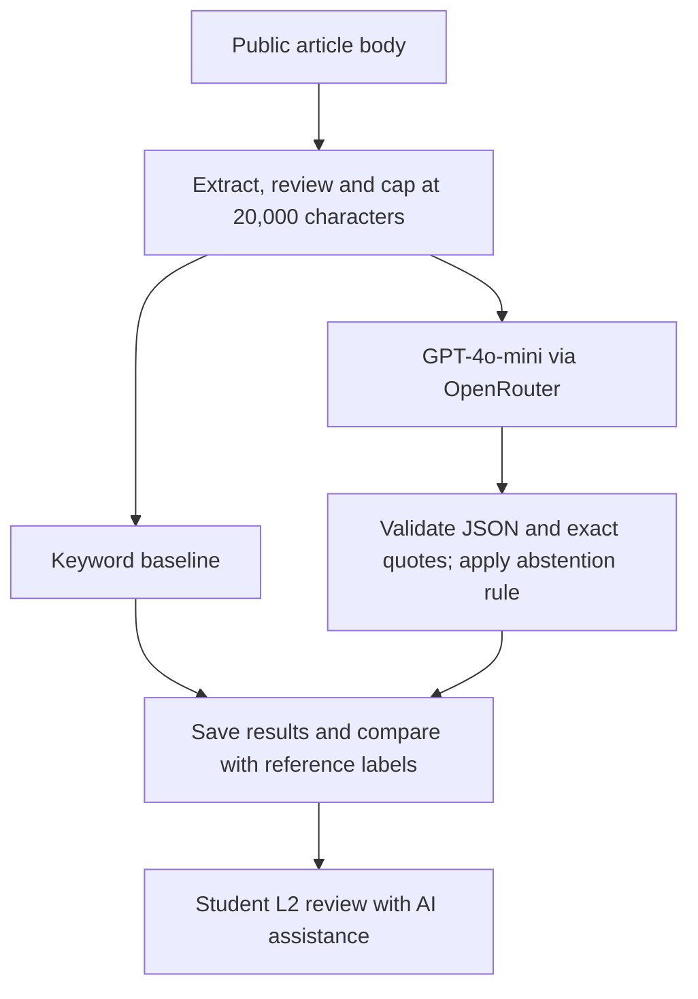

# AdEcho: Product Documentation

Author: ZHANG LIWEI | PE6201 End-of-Course Project

## Persona and purpose
The intended user is an English-language news reader or media-literacy student who wants help identifying promotional signals in an article. AdEcho provides a review aid with quoted evidence. It cannot verify payments, undisclosed sponsorship or a publisher's intentions. User benefit and time savings have not been measured.

## Input and output
Input is public article body text. The evaluation uses 20 student-selected CNA-family articles, with 10 advertorial and 10 editorial reference labels. Both methods receive the same first 20,000 characters, excluding URLs and standalone disclosure headings. One article, ED07, was truncated.

The keyword baseline returns native_ad when a configured disclosure phrase matches, otherwise editorial. The AI returns native_ad, editorial or abstain, together with self-assessed confidence, up to three exact evidence quotes and a reason. Invalid responses are recorded separately with a null label. Confidence is not a calibrated probability. Every real-world decision requires human review.

## High-level architecture

The model prompt treats article text as untrusted data. The validator checks fields, confidence and exact quotation matching. A valid response abstains when confidence is below 0.70, evidence quotes are absent, or the model explicitly abstains. Malformed or ungrounded responses remain errors; they are not silently repaired.

## Targeted and reached metrics
Recorded run: 3f2bbc45d57d3110, executed on 3 October 2026.

| Metric | Target | Recorded outcome |
|---|---|---|
| AI all-case balanced accuracy | 88% | 45% (9/20 correct); target not met |
| AI abstention rate | 5–15% | 10% (2/20) |
| Baseline all-case balanced accuracy | Comparison, no separate target | 50% (10/20) |
| AI binary-decision coverage | No predefined numeric target | 55% (11/20) |
| AI accuracy among binary decisions | No predefined numeric target | 81.8% (9/11) |
| AI L1 valid-response rate | No predefined numeric target | 65% (13/20) |
| AI-assisted student L2 pass rate | No predefined numeric target | 40% (8/20) |
| AI mean call latency | No predefined numeric target | 2.36071 seconds |
| Recorded API cost | No predefined numeric target | US$0.0060108 total |

Meeting the abstention target does not establish useful performance: seven other cases were errors. The baseline classified all articles as editorial and detected no advertisements. Neither method is ready for autonomous use.

## Implementation map
- AdEcho_Final.ipynb: setup, secure credentials, baseline and prompt, data collection and review, live evaluation, summaries, L2 review, export and interactive demonstration.
- adecho_tools.py: standard-library extraction, input preparation, response validation, API calls, result persistence and scoring; the notebook embeds the evaluation utilities for Colab portability.
- data/source_manifest.json: source URLs, reference labels, provenance and input hashes; see data/README.md.
- results/: preserved model outputs, usage, aggregate metrics and student-confirmed review records; see results/README.md.

## Trade-offs and next steps
The hosted model avoids training and hosting a custom classifier but adds external-service dependence, cost and latency. Body-only input tests language signals while removing direct disclosure evidence, making sponsorship potentially unknowable. Exact quotation checks protect evidence fidelity but rejected six responses for case or typography differences and one for an added word.

Potential improvements include carefully specified typography normalization, more precise evidence extraction and fresh multi-publisher evaluation. These are proposals, not implemented or validated improvements. Any changed method should be evaluated on new cases. The present dataset is small, selected from one publisher family and includes two correlated RTS stories. L2 was AI-assisted and is not independent or blinded. No representative real-world accuracy or proven user benefit is claimed.
